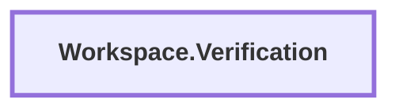

# Workspace.Verification Dependencies

> Generated by `tool.repository-dependency-graph`. Do not edit this file manually.

[Open static SVG](./DEPENDENCIES.svg)

## Relation legend

| Relation | Meaning |
| --- | --- |
| `depends on` | Declared architecture dependency from `dependencies.json`. |
| `locked` | Dependency declared by a lock manifest. |
| `submodule` | Top-level project assembly / checkout relation. |
| `contains` | Workspace source containment; not an architecture dependency. |
